# MercadoLibre Net Prophet Forecasting

## Contents
1. [Step One: Find unusual patterns in hourly Google search traffic](#step-1-find-unusual-patterns-in-hourly-google-search-traffic)

2. [Step Two: Mine the search traffic data for seasonality](#step-2-mine-the-search-traffic-data-for-seasonality)

3. [Step Three: Relate the search traffic to stock price patterns](#step-3-relate-the-search-traffic-to-stock-price-patterns)

4. [Step Four: Create a time series model by using Prophet](#step-4-create-a-time-series-model-by-using-prophet)

5. [Step Five (Optional): Forecast the revenue by using time series models](#step-5-optional-forecast-the-revenue-by-using-time-series-models)

6. [Conclusion](#conclusion)

7. [Results](#results)

## Step 1: Find Unusual Patterns in Hourly Google Search Traffic
The data science manager asks if the Google Search traffic for the company links to any financial events at the company. Or, does the search traffic data just present random noise? To answer this question, you’ll pick out any unusual patterns in the Google Search data for the company, and connect them to the corporate financial events.

To do so, complete the following steps:

    1. Read the search data into a DataFrame, and then slice the data to just the month of May 2020. 
        * During this month, MercadoLibre released its quarterly financial results.

        * Use hvPlot to visualize the results. 

        * Do any unusual patterns exist?

    2. Calculate the total search traffic for the month, and then compare the value to the monthly median across all months. 
        ** Did the Google Search traffic increase during the month that MercadoLibre released its financial results?
```python
# Store data in a Pandas DataFrame
df_mercado_trends = pd.read_csv(
    'google_hourly_search_trends.csv',
    infer_datetime_format= True,
    index_col= 'Date',
    parse_dates= True
).dropna()

# Slice the DataFrame to just the month of May 2020
df_may_2020 = df_mercado_trends.loc['2020-05']

# Use hvPlot to visualize the data for May 2020
df_may_2020.hvplot(title= 'May 2020 Search trends')

# Calculate the sum of the total search traffic for May 2020
traffic_may_2020 = df_may_2020.loc['2020-05'].sum()

# View the traffic_may_2020 value
int(traffic_may_2020)

# Calcluate the monthly median search traffic across all months 
# Group the DataFrame by index year and then index month, chain the sum and then the median functions
median_monthly_traffic = df_mercado_trends['Search Trends'].groupby(by = [df_mercado_trends.index.year, df_mercado_trends.index.month]).sum().median()

# Compare the seach traffic for the month of May 2020 to the overall monthly median value
comparison = int(traffic_may_2020) - median_monthly_traffic
if int(traffic_may_2020) > median_monthly_traffic:
    print(f'Search traffic for the month of May is {comparison} higher than the median monthly traffic')
else:
    print(f'Search traffic for the month of May is {comparison} lower than the median monthly traffic ')
```
##### Answer the following question: 

**Question:** Did the Google search traffic increase during the month that MercadoLibre released its financial results?

**Answer:** Yes, there was a search traffic increase on May 5 (between 119-125) while the other days maintained a cyclical pattern.

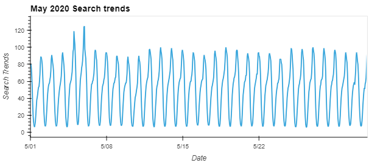

## Step 2: Mine the Search Traffic Data for Seasonality
The marketing department realizes that they can use the hourly search data, too. If they can track and predict interest in the company and its platform for any time of day, they can focus their marketing efforts around the times that have the most traffic. This will get a greater return on investment (ROI) from their marketing budget.

To that end, you want to mine the search traffic data for predictable seasonal patterns of interest in the company. To do so, complete the following steps:

    1. Group the hourly search data to plot the average traffic by the day of the week (for example, Monday vs. Friday).
```python
# Group the hourly search data to plot (use hvPlot) the average traffic by the day of week 
hourly_search = df_mercado_trends['Search trends'].groupby(by=[df_mercado_trends.index.dayofweek]).mean()
hourly_search.hvplot(title = 'Average Search Traffic by Day of the Week')
```
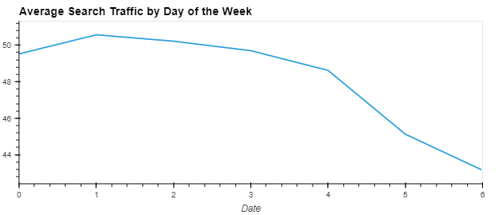

    2. Using hvPlot, visualize this traffic as a heatmap, referencing index.hour for the x-axis and index.dayofweek for the y-axis. 
        ** Does any day-of-week effect that you observe concentrate in just a few hours of that day?
```python
# Use hvPlot to visualize the hour of the day and day of week search traffic as a heatmap.
df_mercado_trends.hvplot.heatmap(
    x='index.hour',
    y='index.dayofweek',
    C = 'Search Trends',
    cmap = 'reds',
    title = 'Average Search Traffic by the hour of the day'
).aggregate(function=np.mean)
```
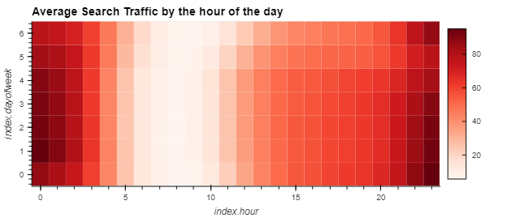
##### Answer the following question:

**Question:** Does any day-of-week effect that you observe concentrate in just a few hours of that day?

**Answer:** Yes, there was a 94.9 search trend on Monday(at index.hour 0).

    3. Group the search data by the week of the year. Does the search traffic tend to increase during the winter holiday period (Weeks 40 through 52)?

```python
# Group the hourly search data to plot (use hvPlot) the average traffic by the week of the year
hourly_search_yearly = df_mercado_trends.index.isocalendar().week
df_mercado_trends.groupby(by=hourly_search_yearly).mean().hvplot(title='Average Search Traffic by Week of the Year')
```
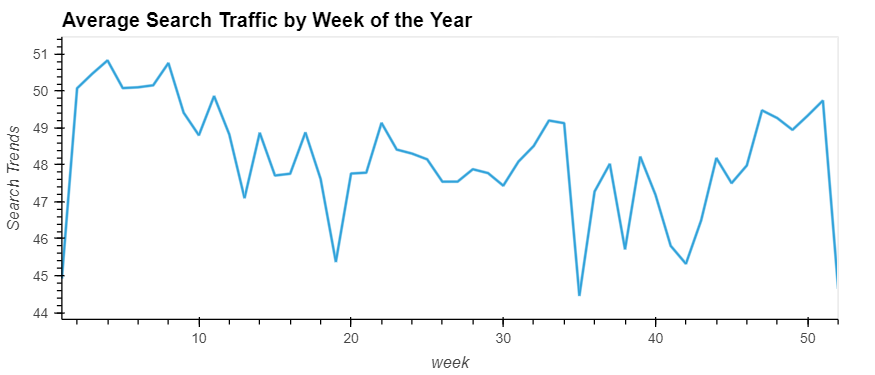

##### Answer the following question:

**Question:** Does the search traffic tend to increase during the winter holiday period (weeks 40 through 52)?

**Answer:** There was a upward spike from week 42 to week 51, and downward trend in week 52

# Step 3: Relate the Search Traffic to Stock Price Patterns
During a meeting with people in the finance group at the company, you mention your work on the search traffic data. They want to know if any relationship between the search data and the company stock price exists, and they ask if you can investigate.

To do so, complete the following steps:

    1. Read in and plot the stock price data. Concatenate the stock price data to the search data in a single DataFrame.
```python
#Store Data in Pandas Dataframe
df_mercado_stock = pd.read_csv(
    'mercado_stock_price.csv',
    infer_datetime_format = True,
    index_col = 'date',
    parse_dates= True
).dropna()

# Use hvPlot to visualize the closing price of the df_mercado_stock DataFrame
df_mercado_stock.hvplot(title= 'Mercado Stock Closing Price')

# Concatenate the df_mercado_stock DataFrame with the df_mercado_trends DataFrame
# Concatenate the DataFrame by columns (axis=1), and drop and rows with only one column of data
mercado_stock_trends_df =pd.concat([df_mercado_stock, df_mercado_trends], axis= 1).dropna()
```
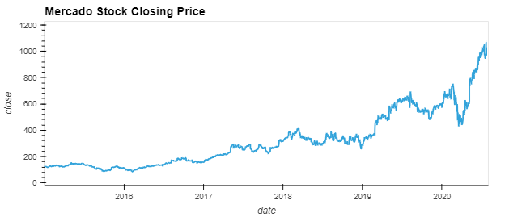

    2. Note that market events emerged during 2020 that many companies found difficult. But after the initial shock to global financial markets, new customers and revenue increased for e-commerce platforms. So, slice the data to just the first half of 2020 (2020-01 to 2020-06 in the DataFrame), and then use hvPlot to plot the data. Do both time series indicate a common trend that’s consistent with this narrative?
```python
# For the combined dataframe, slice to just the first half of 2020 (2020-01 through 2020-06) 
first_half_2020 = mercado_stock_trends_df.loc['2020-01':'2020-06']

# Use hvPlot to visualize the close and Search Trends data
# Plot each column on a separate axes using the following syntax
# `hvplot(shared_axes=False, subplots=True).cols(1)`
first_half_2020.hvplot(
    shared_axes = False,
    subplots = True,
).cols(1)
```
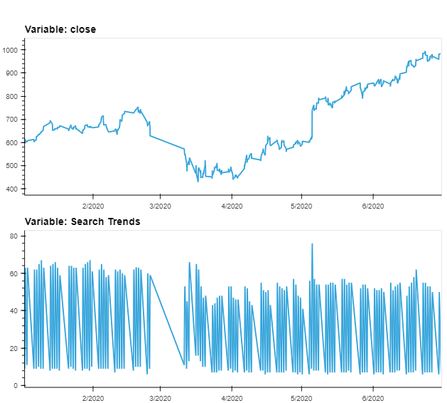

##### Answer the following questions:

**Question:** Do both time series indicate a common trend that’s consistent with this narrative?

**Answer:**  Yes, there was a step downward trend in March 2020 due to the global pandemic but there was a spike up (upward trend) in April 2020.

    3. Create a new column in the DataFrame named “Lagged Search Trends” that offsets, or shifts, the search traffic by one hour. Create two additional columns:

        * “Stock Volatility”, which holds an exponentially weighted four-hour rolling average of the company’s stock volatility

        * “Hourly Stock Return”, which holds the percentage of change in the company stock price on an hourly basis
```python
# Create a new column in the mercado_stock_trends_df DataFrame called Lagged Search Trends
# This column should shift the Search Trends information by one hour
mercado_stock_trends_df['Lagged Search Trends'] = mercado_stock_trends_df['Search Trends'].shift(periods=1)

# Create a new column in the mercado_stock_trends_df DataFrame called Stock Volatility
# This column should calculate the standard deviation of the closing stock price return data over a 4 period rolling window
mercado_stock_trends_df['Stock Volatility'] = mercado_stock_trends_df['close'].pct_change().rolling(window=4).std()

# Use hvPlot to visualize the stock volatility
mercado_stock_trends_df['Stock Volatility'].hvplot(title='Stock Volatility')

# Create a new column in the mercado_stock_trends_df DataFrame called Hourly Stock Return
# This column should calculate hourly return percentage of the closing price
mercado_stock_trends_df['Hourly Stock Return'] = mercado_stock_trends_df['close'].pct_change()

# Construct correlation table of Stock Volatility, Lagged Search Trends, and Hourly Stock Return
mercado_stock_trends_df [[ 'Stock Volatility','Lagged Search Trends', 'Hourly Stock Return']].corr()
```
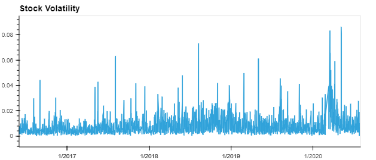

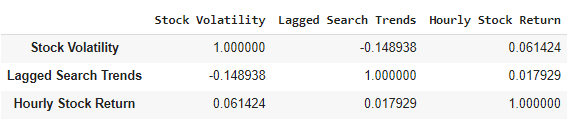

    4. Review the time series correlation, and then answer the following question: Does a predictable relationship exist between the lagged search traffic and the stock volatility or between the lagged search traffic and the stock price returns?

##### Answer the following questions:

**Question:** Does a predictable relationship exist between the lagged search traffic and the stock volatility or between the lagged search traffic and the stock price returns?

**Answer:** There is a low negative correlation between lagged search traffic and the stock volatility and there is a low positive correlation between the lagged search traffic and the stock price returns.

# Step 4: Create a Time Series Model by Using Prophet
Now, you need to produce a time series model that analyzes and forecasts patterns in the hourly search data. To do so, complete the following steps:

    1. Set up the Google Search data for a Prophet forecasting model.
```python
# Using the df_mercado_trends DataFrame, reset the index so the date information is no longer the index
mercado_prophet_df = df_mercado_trends.reset_index()

# Label the columns ds and y so that the syntax is recognized by Prophet
mercado_prophet_df.columns = ['ds', 'y']

# Drop an NaN values from the prophet_df DataFrame
mercado_prophet_df = mercado_prophet_df.dropna()

# Call the Prophet function, store as an object
model_mercado_trends = Prophet()

# Fit the time-series model.
model_mercado_trends.fit(mercado_prophet_df)

# Create a future dataframe to hold predictions
# Make the prediction go out as far as 2000 hours (approx 80 days)
future_mercado_trends = model_mercado_trends.make_future_dataframe(periods = 2000, freq='H')

# Make the predictions for the trend data using the future_mercado_trends DataFrame
forecast_mercado_trends = model_mercado_trends.predict(future_mercado_trends)

# Plot the Prophet predictions for the Mercado trends data
model_mercado_trends.plot(forecast_mercado_trends)
```
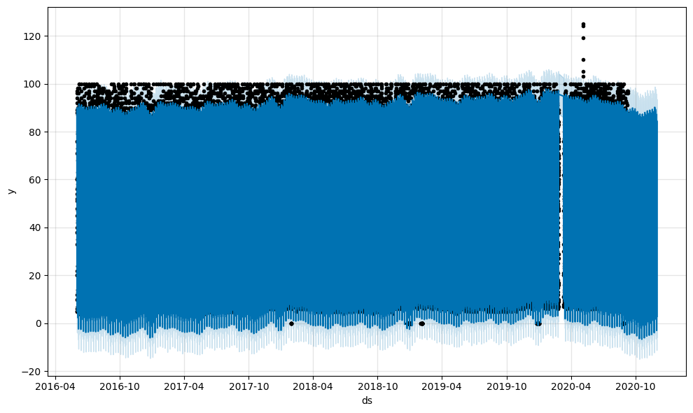


    2. After estimating the model, plot the forecast. How's the near-term forecast for the popularity of MercadoLibre?

##### Answer the following question:
**Question:**  How's the near-term forecast for the popularity of MercadoLibre?

**Answer:** There's a decline in the near-term forecast

    3. Plot the individual time series components of the model to answer the following questions:

```python
# Set the index in the forecast_mercado_trends DataFrame to the ds datetime column
forecast_mercado_trends = forecast_mercado_trends.set_index('ds')

# View only the yhat,yhat_lower and yhat_upper columns from the DataFrame
forecast_mercado_trends[['yhat','yhat_lower', 'yhat_upper']]

# From the forecast_mercado_trends DataFrame, use hvPlot to visualize
#  the yhat, yhat_lower, and yhat_upper columns over the last 2000 hours 
forecast_mercado_trends[['yhat','yhat_lower', 'yhat_upper']].iloc[-2000:,:].hvplot()

# Reset the index in the forecast_mercado_trends DataFrame
forecast_mercado_trends = forecast_mercado_trends.reset_index()

# Use the plot_components function to visualize the forecast results 
# for the forecast_canada DataFrame 
figures_mercado_trends = model_mercado_trends.plot_components(forecast_mercado_trends)
```
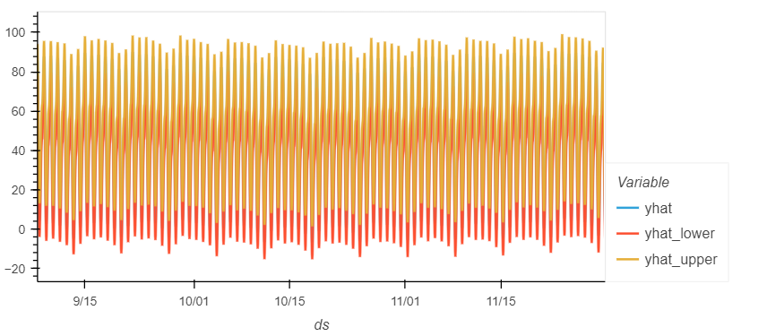

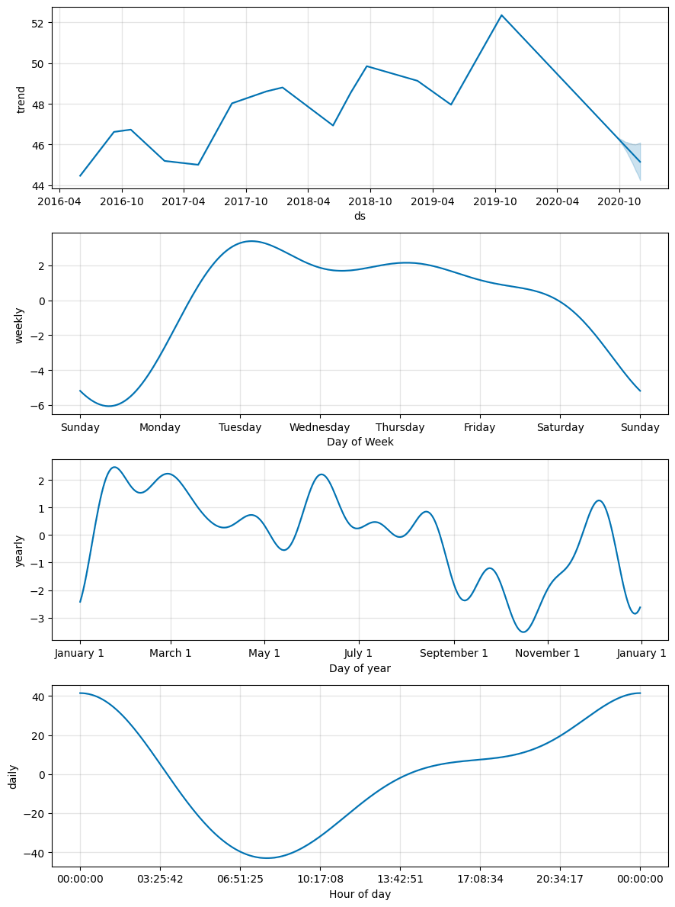

##### Answer the following questions:

**Question:** What time of day exhibits the greatest popularity?

**Answer:** 00:00:00 Midnight

**Question:** Which day of the week gets the most search traffic?

**Answer:** Tuesday

**Question:** What's the lowest point for search traffic in the calendar year?

**Answer:**  Between October and November

# Step 5 (Optional): Forecast the Revenue by Using Time Series Models
A few weeks after your initial analysis, the finance group follows up to find out if you can help them solve a different problem. Your fame as a growth analyst in the company continues to grow!

Specifically, the finance group wants a forecast of the total sales for the next quarter. This will dramatically increase their ability to both plan budgets and help guide expectations for the company investors.

To do so, complete the following steps:

    1. Read in the daily historical sales (that is, revenue) figures, and then apply a Prophet model to the data.

```python
df_mercado_sales = pd.read_csv(
    'mercado_daily_revenue.csv',
    infer_datetime_format= True,
    index_col='date',
    parse_dates= True
).dropna()

# Use hvPlot to visualize the daily sales figures 
df_mercado_sales.hvplot(
    title = 'Mercardo Daily Revenue'
)

# Apply a Facebook Prophet model to the data.

# Set up the dataframe in the neccessary format:
# Reset the index so that date becomes a column in the DataFrame
mercado_sales_prophet_df = df_mercado_sales.reset_index()

# Adjust the columns names to the Prophet syntax
mercado_sales_prophet_df.columns = ['ds','y']

# Create the model
mercado_sales_prophet_model = Prophet()

# Fit the model
mercado_sales_prophet_model.fit(mercado_sales_prophet_df)

# Predict sales for 90 days (1 quarter) out into the future.

# Start by making a future dataframe
mercado_sales_prophet_future = mercado_sales_prophet_model.make_future_dataframe(periods= 90, freq= 'D')

# Make predictions for the sales each day over the next quarter
mercado_sales_prophet_forecast = mercado_sales_prophet_model.predict(mercado_sales_prophet_future)
```
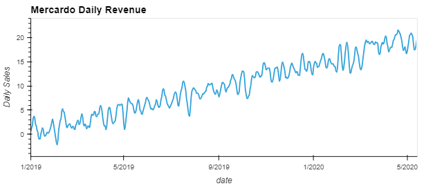

    2. Interpret the model output to identify any seasonal patterns in the company revenue. For example, what are the peak revenue days? (Mondays? Fridays? Something else?)

```python
# Use the plot_components function to analyze seasonal patterns in the company's revenue
figures_mercado_rev = mercado_sales_prophet_model.plot_components(mercado_sales_prophet_forecast)
```
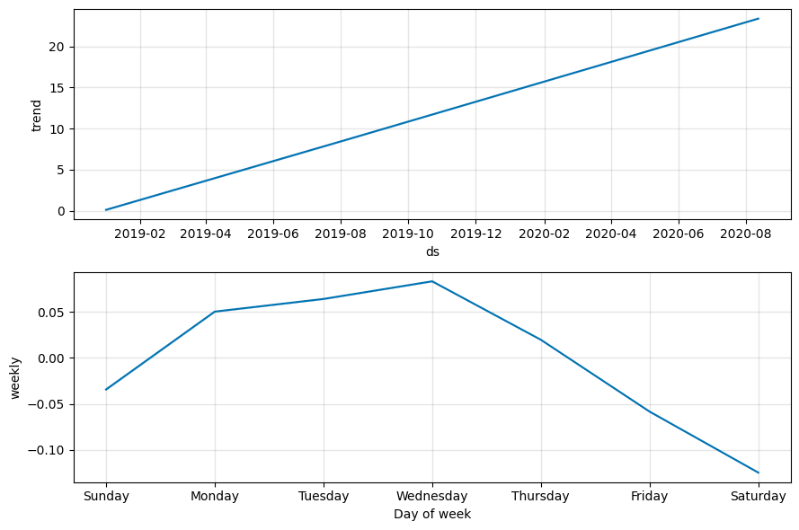

##### Answer the following question:

**Question:** For example, what are the peak revenue days? (Mondays? Fridays? Something else?)

**Answer:** Mondays - Wednesdays

    3. Produce a sales forecast for the finance group. Give them a number for the expected total sales in the next quarter. Include the best- and worst-case scenarios to help them make better plans.

```python
# Plot the predictions for the Mercado sales
mercado_sales_prophet_model.plot(mercado_sales_prophet_forecast)

# For the mercado_sales_prophet_forecast DataFrame, set the ds column as the DataFrame Index
mercado_sales_prophet_forecast = mercado_sales_prophet_forecast.set_index('ds')

# Produce a sales forecast for the finance division
# giving them a number for expected total sales next quarter.
# Provide best case (yhat_upper), worst case (yhat_lower), and most likely (yhat) scenarios.

# Create a forecast_quarter Dataframe for the period 2020-07-01 to 2020-09-30
# The DataFrame should include the columns yhat_upper, yhat_lower, and yhat
mercado_sales_forecast_quarter = mercado_sales_prophet_forecast.loc['2020-07-01': '2020-09-30']
mercado_sales_forecast_quarter = mercado_sales_prophet_forecast[['yhat', 'yhat_upper', 'yhat_lower']]

# Update the column names for the forecast_quarter DataFrame
# to match what the finance division is looking for 
mercado_sales_forecast_quarter = mercado_sales_forecast_quarter.rename(
    columns = {'yhat':'Most Likely', 'yhat_upper':'Best Case', 'yhat_lower':'Worst Case'}
)

# Display the summed values for all the rows in the forecast_quarter DataFrame
mercado_sales_forecast_quarter.sum()
```
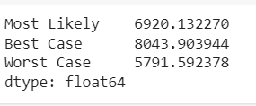


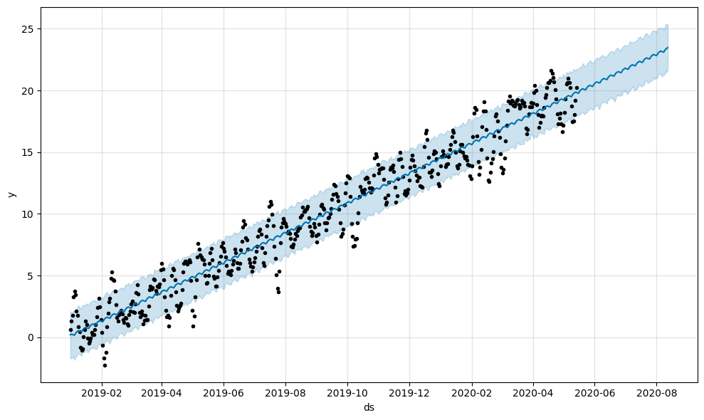

### Based on the forecast information generated above, produce a sales forecast for the finance division, giving them a number for expected total sales next quarter. Include best and worst case scenarios, to better help the finance team plan.

**Answer:** Sales forecast for the finance division for 2020-07-01 to 2020-09-30 is 6920, with a best case scenario of 8044 and worst case scenario of about 5792.

## Conclusion
* Aim of project:
    * analyze patterns in search data in interval time
    * implementing models to predict future values 
    * Graphical representation of original and forecast models

## Results

**Results:* [Analysis-Colab-link](https://colab.research.google.com/drive/1jAK0IsgoFwl41xFJ4M2G1Oo8ZXU22Ocn#scrollTo=pQjhSkHYtD9N)
